**Predictive Model of Neighborhood Change**
===========================================

Alex Amy (aaa453), Brandt Beckerman (bnb44), Rebecca Lassman (rsl252),
Toby Leung (htl9)

### ***ABSTRACT* - *Gentrification in major urban centers around the world has led to the movement and displacement of tens of millions of people. New York City is no different facing rapid neighborhood change on a yearly basis. While the effects of gentrification have long been studied, the indicators of gentrification are still mired in mystery. Utilizing US Census and NYC PLUTO datasets, this paper generates a model to predict which neighborhoods will see high, medium, or low growth in property values five years in the future. This study builds on existing research by discovering the factors that lead to high and low neighborhood growth rates. Through understanding the factors that lead to soon-to-be high value neighborhoods, as well as those of stagnating neighborhoods, policymakers will be able to develop early interventions to counteract well defined negative impacts and better combat economic inequality in cities.***

### INTRODUCTION

Growing income inequality is exacerbated when households and small
businesses are priced out of their neighborhoods. However, this is a
complex problem as the city also has a growing housing demand that can
only be satiated by developing the less established boroughs. As a
result, in building a predictive model of neighborhood change, this
study allows the city to tackle the problem from two fronts. First, it
would provide policymakers an ample amount of time and foresight to
establish policies to protect vulnerable neighborhoods ahead of time.
Second, it indicates what census features are most expressive of
neighborhood change and stagnation, thus giving policymakers a better
understanding of the larger holistic problem. Our analysis classifies
neighborhoods based on the growth of property values and applies a suite
of predictive models to determine which of a neighborhood's census
features can predict its growth profile in subsequent years.

### BACKGROUND

Given the profound interest in the study of gentrification, there have
been significant scholarly research across a wide variety of disciplines
over the last 50 years including but not limited to: epidemiology and/in
the context of gentrification and its impact on the health outcomes out
the citizenry \[1\]; economics/sociology studying the movement of
individuals away from city centers as a result of rising prices both in
terms of housing and extraneous goods \[2\]; and environmental sciences
and the impact of green initiatives on the ability for lower income
residents being able to live in and around these areas \[2\]. The
interest in this field from many different perspectives indicates that
it is an area where the application of computer science to aid in this
research is incredibly applicable/sorely needed. A paper from NYU's
Center for Urban Science + Progress, sought to visualize population
movement due to gentrification and while robust in its design did not
seek to find the actual factors that lead to gentrification \[4\].
Factor's leading to gentrification have been surmised and studied for
decades and through our paper we will seek to provide an answer to this
quandary using quantitative analysis from census data.

### METHOD

#### DATA PREPARATION

Our dependent variable is the change in property tax assessment values
between 2010 - 2020, classified into three target categories. To create
this target we copied the NYC PLUTO dataset for the years 2010, 2015 and
2020 then aggregated assessment values in each year by zip code,
calculated growth rates in the 5-year and 10-year periods, and
classified each zip code as low (3), medium (2) or high (1) growth based
upon whether it fell below, within, or above the first and third
quartile of growth rates.

Our independent variables included socioeconomic, demographic, and
housing characteristics of each zip code queried from the Census API. We
used data from the American Community Survey 5-year as it provides the
most reliable estimates. The data through the API at the zip code level
is only published for the years between 2011 and 2018, so, while our
assessment value data is from 2010, 2015 and 2020, the Census data we
have ties to 2011, 2015 and 2018. Given the pace at which these
variables change over a geographic area as large and varied as NYC, we
are comfortable with these timeframes.

All census features are categorical and represent the percent of the
population that fits the feature column (e.g. share of population in zip
code older than 65). Our preprocessing steps included deletion of
features (columns) and zip codes (rows) where the majority of entries
were missing or populated with corrupted data (in the form of
-6666666666 and -8888888888). Next we adjusted the columns names to
match between the three year periods, and dropped categories that could
not be translated across the three years to get three comparable
datasets which we could merge into a single large dataset. This brought
the number of features in each year down from 452 to 321. See the
appendix for a breakdown of the features.

#### MODELING APPROACH

In this project we use three supervised learning algorithms: Logistic
Regression (LR), Support Vector Machines (LinearSVM), and Random Forests
(RF). This suite of discriminative machine learning algorithms were
chosen to analyze our data due to the diverse set of geometric and
tree-based perspectives they offered our classification problem.

We use two feature datasets each in a different temporal variation:
point in time (PIT) and compound annual growth rate (CAGR). We trained
the PIT and CAGR datasets independently vis-à-vis the aforementioned
models, with the intuition that point-in-time and change over time data
could provide different insights into property growth values. Given the
large number of features in both datasets (321), we then experimented
with two methods for adjusting the feature space (in addition to
baseline which used all features as given), these included SelectKBest
and Principal Component Analysis (PCA). In sum, we conducted 18
modelling exercises within a broader experimental structure as follows:

FIGURE 1. MODEL APPROACH

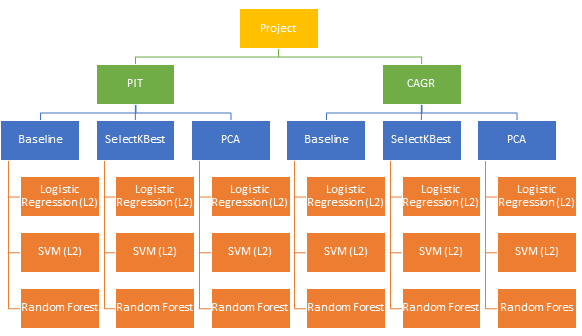{width="4.458333333333333in"
height="2.1770833333333335in"}{width="1.5041590113735783in"
height="0.520670384951881in"}

#### DIMENSIONALITY REDUCTION METHODS

To reduce the dimensionality of our feature space, we used SciKitLearn's
implementations of SelectKBest and PCA. We chose these methods due to
their divergent approaches to collapsing the feature space. SelectKBest
calculates the chi-squared statistics for each column relative to the
target then drops all but the K most highly-correlated. On the other
hand PCA projects a high-dimensional dataset onto a lower-dimensional
subspace whose span approximates the directions of maximal variance of
the original data. Essentially, the principal components are a
user-specified number of linear combinations of the original features
that seek to explain the greatest amount of variance of the original
data. Given its more analytic perspective, we thought PCA was highly
complementary to SelectKBest's more heuristic approach in the context of
our problem.

To ensure we selected the optimal number of features, we iterated
through possible subsets ranging from 10-320 in increments of 10. We
then ran our models on each of these feature subsets and selected the
one that optimized each model's respective holdout F1-score. Similarly,
to ensure we selected the optimal number of principal components, we
iterated through possible subspaces ranging in dimension from 5-175 in
increments of 5 (due to our dataset's having fewer rows than columns).
We then ran our models on each of these subspaces and selected the one
that optimized each model's respective holdout F1-score.

#### HYPERPARAMETER TUNING

Given the limited number of data points in our datasets (180 zip codes),
we used cross validation on our train set to tune the model
hyperparameters. We began by identifying the optimal number of k-folds
for cross validation. For LR models we experimented with the multinomial
class (one-versus-rest vs. multinomial) and regularization strength
(C-value). For LinearSVM we similarly experimented with the
regularization parameter. For RF models, we adjusted the number of
trees, minimum split percent, minimum leaf percent and maximum depth to
enforce pruning. The regularization and pruning were particularly
important to reduce algorithmic complexity given the small number of
data points. Further details of the results of this hyperparameter
tuning can be seen in the appendix.

### EXPERIMENTAL ANALYSIS

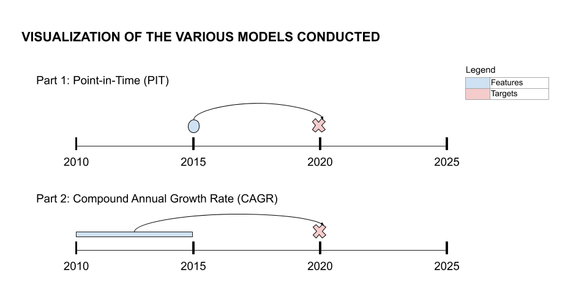{width="4.166666666666667in"
height="2.12543416447944in"}

Our experimental analysis uses PIT and CAGR datasets to predict the
2015-2020 assessment value growth profile, a target feature that we
generated through mapping changes in zip codes' assessment value from
2015-2020. The figure to the right depicts this approach.

We developed a total of 18 models representing a combination of two
feature types (PIT and CAGR), three feature selection methods (Baseline,
SelectKbest, and PCA), and three algorithms (LR with L2 regularization,
LinearSVM, RF). The results of these models are detailed in figure 2
below.

FIGURE 2. SUMMARY OF PERFORMANCE & MODEL PARAMETERS

+---------+---------+---------+---------+---------+---------+---------+
| **      | **PIT** | *       |         |         |         |         |
| Feature |         | *CAGR** |         |         |         |         |
| Da      |         |         |         |         |         |         |
| taset** |         |         |         |         |         |         |
+=========+=========+=========+=========+=========+=========+=========+
| **      | B       | Feature | Dimensi | B       | Feature | Dimensi |
| Feature | aseline | Se      | onality | aseline | Se      | onality |
| Dim     |         | lection | Re      |         | lection | Re      |
| ensiona |         | (Selec  | duction |         | (Selec  | duction |
| lity/** |         | tKBest) | (PCA)   |         | tKBest) | (PCA)   |
|         |         |         |         |         |         |         |
| **Re    |         |         |         |         |         |         |
| duction |         |         |         |         |         |         |
| M       |         |         |         |         |         |         |
| ethod** |         |         |         |         |         |         |
+---------+---------+---------+---------+---------+---------+---------+
| **Test  |         |         |         |         |         |         |
| Perfor  |         |         |         |         |         |         |
| mance** |         |         |         |         |         |         |
+---------+---------+---------+---------+---------+---------+---------+
| L       | 0.4899  | 0.4899  | 0.3260  | 0.3763  | 0.3972  | 0.3260  |
| ogistic |         |         |         |         |         |         |
| Reg     |         |         |         |         |         |         |
| ression |         |         |         |         |         |         |
| (L2)    |         |         |         |         |         |         |
+---------+---------+---------+---------+---------+---------+---------+
| Li      | 0.4067  | 0.3260  | 0.4067  | 0.2897  | 0.4159  | 0.5019  |
| nearSVM |         |         |         |         |         |         |
+---------+---------+---------+---------+---------+---------+---------+
| Rando   | 0.5312  | 0.5833  | 0.4722  | 0.6119  | 0.4861  | 0.3981  |
| mForest |         |         |         |         |         |         |
+---------+---------+---------+---------+---------+---------+---------+
| **Model |         |         |         |         |         |         |
| Param   |         |         |         |         |         |         |
| eters** |         |         |         |         |         |         |
+---------+---------+---------+---------+---------+---------+---------+
| **C     | 10      | 10      | 10      | 100     | 10      | 10      |
| value** |         |         |         |         |         |         |
|         |         |         |         |         |         |         |
| L       |         |         |         |         |         |         |
| ogistic |         |         |         |         |         |         |
| Reg     |         |         |         |         |         |         |
| ression |         |         |         |         |         |         |
| (L2)    |         |         |         |         |         |         |
+---------+---------+---------+---------+---------+---------+---------+
| **C     | 1       | 0.1     | 0.1     | 10      | 0.1     | 0.1     |
| value** |         |         |         |         |         |         |
|         |         |         |         |         |         |         |
| Li      |         |         |         |         |         |         |
| nearSVM |         |         |         |         |         |         |
+---------+---------+---------+---------+---------+---------+---------+
| *       | 32      | 16      | 16      | 16      | 16      | 16      |
| *Number |         |         |         |         |         |         |
| of      |         |         |         |         |         |         |
| Trees** |         |         |         |         |         |         |
|         |         |         |         |         |         |         |
| Rando   |         |         |         |         |         |         |
| mForest |         |         |         |         |         |         |
+---------+---------+---------+---------+---------+---------+---------+
| **Max   | 9       | 4       | 4       | 10      | 4       | 4       |
| depth** |         |         |         |         |         |         |
|         |         |         |         |         |         |         |
| Rando   |         |         |         |         |         |         |
| mForest |         |         |         |         |         |         |
+---------+---------+---------+---------+---------+---------+---------+

PART 1: POINT-IN-TIME (PIT) MODELS

In this first set of models, we use 2015 PIT census data as our features
and the 2015 - 2020 assessment value growth classification labels as our
target. We partition the data using a 90/10 train/test split ratio and
10 fold cross validation to tune the model parameters for all three
algorithms.

In each of our Baseline, Feature Selected and Reduced Dimensionality
experiments with the PIT dataset, RFs significantly outperformed LR and
LinearSVM models. Our best-performing RF model achieved an F1-score of
0.5833 with 16 trees and maximum depth of 4 running on a SelectKBest
feature-selected columns space of dimension 190. The top 10 features in
the RF model were (1) the percent of housing stock with 5-9 housing
units each, (2) the percent of adults with less than a 9th grade
education, (3) the percent of the population aged 15-19, (4) the percent
of housing stock with 3-4 housing units, (5) the percent of housing
units with 3 rooms, (6) the percent of housing stock with 2 housing
units each, (7) the percent of households with income [\>]{.ul}
\$200,000, (8) the percent of housing stock with 20 or more housing
units each, (9) the percent of working adults who drove to work alone,
and (10) the percent of housing units built from 1970-1979.

With a reasonably high F1-score and top features that broadly capture
some of our intuition for the problem space, this model had relatively
low false positive and false negative rates of 16.7% and 16.0%,
respectively (from the perspective of identifying high-growth
neighborhoods). Examining the model's errors more granularly, we found
that 63% of the model's false positives came from miscategorizing 2s
(moderate growth) as 1s (high growth). Similarly, 77% of its false
negatives came from miscategorizing 1s as 2s. Intuitively it makes sense
that the bulk of the errors come from adjacent classifications, as
compared to a misclassification from 3s to 1s or vice-versa.

PART 2: COMPOUND ANNUAL GROWTH RATE (CAGR) MODELS

To investigate whether the temporal element of feature generation makes
for a better predictor of assessment value growth, in the second group
of models we use the 2011- 2015 CAGR values as the model features. Once
again, we create a 90/10 train/test split, 10 fold cross validation and
fit the training data to the same models utilized on the PIT dataset,
with the same target of the 2015 - 2020 assessment value growth profile.

Our best-performing model on the CAGR was a RF that achieved an F1-score
of 0.6119 with 16 trees and maximum depth of 10 running on the baseline
column-space of dimension 321. The top 10 features are discussed in the
following section.

In terms of errors, this model was broadly consistent with the
feature-selected PIT model, with false positive and false negative rates
of 17.3% and 16%, respectively. It also exhibited similarly outsized
miscategorizations of 2s to 1s and 1s to 2s as the feature-selected PIT
model. Interestingly, our LR, LinearSVC and RF models trained on the
baseline CAGR data exhibited virtually identical error profiles.
Moreover, they all miscategorized the same neighborhoods in exactly the
same way, as demonstrated by selected examples below:

FIGURE 3. ERROR ANALYSIS

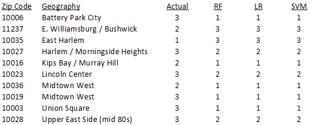{width="4.659722222222222in"
height="1.8225131233595802in"}

Given the different approaches taken by each of our three learning
models, this pattern gives us comfort in our experimental setup and
modelling exercises.

### DISCUSSION AND PRIOR WORK

Looking at our strongest model, CAGR baseline using RF algorithm, our
findings suggest that the top ten variables that are the strongest
predictors of neighborhood change include the compound annual growth
rate of: (1) population younger than 5, (2) population that identifies
as both white and Asian, (3) housing stock with 5 rooms, (4) adult
population with a graduate or professional degree, (5) population born
in the U.S. but not in New York, (6) population with nonrelatives in
household, (7) married female population, (8) population with "white
collar" jobs, (9) housing units with a mortgage, and (10) population
considered to be housing insecure.

Prior work approaches the predictive model with a set of features
beforehand. For instance, in the UDP study, they believe the following
factors are indicative of gentrification risk: (1) high share of
low-income households, (2) high share of renters, (3) high share of
non-white population, (4) low share of with-collage degree population,
(5) comparatively low housing values and rents, (6) high housing values
and/or rents growth, (7) high architectural value, (8) proximity to
transit, and (9) longitudinal change of the above.

Although the two lists do not perfectly mirror one another, there are
clear parallels (e.g. (5) our list and (4) in UDP's, etc.). It is also
important to note that the most important features we listed above
essentially unaltered from how they are listed in the Census format,
while several UDP's are somewhat more saturated with information (e.g.
"high architectural value," etc.). Moreover, the 10 features we listed
above are only a small portion of the features identified by our broader
modelling effort. When all models / data regimes are considered, our
most important features easily encompass those identified by UDP.

Our findings provide information that can help researchers and policy
makers identify the ways in which neighborhoods are expected to change
in the future and enable them to counteract negative impacts of expected
high growth on low income households or similarly prevent sliding values
in stagnating neighborhoods where impacts might be most significant.

However, using only this data set, we might be overestimating the impact
of socioeconomic, demographic, and housing variables on assessment
values. This may result from exogenous factors that impact property
values, such as interest rates, mortgage availability and stock prices
that are not incorporated into the census data. Further, these variables
change in real time whereas the census data used is a 5-year average. A
second limitation of this study is that census data years do not align
perfectly with the assessment value years as the release of census data
is typically delayed by a year. A third limitation is that assessment
values in NYC are not synonymous with market values. The calculation of
assessment values differs by tax class and is bounded by limitations on
assessment increases year over year.

### CONCLUSION 

Socioeconomic, demographic and housing indicators can predict changes in
neighborhood property assessment values. In NYC our model was able to
accurately classify 61% of the zip codes based on those indicators
alone. This demonstrates that researchers and policy makers should
explore the use of machine learning algorithms for understanding future
neighborhood changes in their city.

Further research can build on our work by incorporating additional
property and building variables into the feature set, experimenting with
different classification thresholds, incorporating market valuation data
as the target replacing assessment data, and considering other types of
models such as regression (to predict the percent change in values). One
extension we hope to see is the application of this model to 2018 census
data to predict the neighborhood valuation growth rates in 2025. A
second extension we would like to do is deeper error analysis by looking
at how the data values for the misclassified zip codes compared to the
correctly classified zip codes.

With large portions of Manhattan and Brooklyn already reaching their
limits of development, property developers are forced to widen their
search radius. However, this action is not free from unintended
consequences. When real estate companies develop high-value properties
in previously lower-income neighborhoods, existing residents are either
displaced or face other economic pressures. In order to implement
anti-displacement and equitable development strategies, the city needs
to act ahead of time to tackle the swift forces. With the information
provided/research conducted in this paper city officials can begin to
understand what leads to gentrification and implement the measures they
see fit.

### REFERENCES

\[1\]
[[https://www.ncbi.nlm.nih.gov/pmc/articles/PMC7241805/]{.ul}](https://www.ncbi.nlm.nih.gov/pmc/articles/PMC7241805/)

\[2\]
[[https://www.tandfonline.com/doi/full/10.1080/02723638.2016.1276718]{.ul}](https://www.tandfonline.com/doi/full/10.1080/02723638.2016.1276718)

\[3\][[https://www.tandfonline.com/doi/full/10.1080/02723638.2017.1360041?casa_token=qyUD78zo-GYAAAAA%3AOXm5NEbUzr86_JN_Vc8NrOFTAv017yflmf5mmAJ7gKvMCCWGoZj_Y9ldJKcPNKKUKwOiuCfWVBTaAGY]{.ul}](https://www.tandfonline.com/doi/full/10.1080/02723638.2017.1360041?casa_token=qyUD78zo-GYAAAAA%3AOXm5NEbUzr86_JN_Vc8NrOFTAv017yflmf5mmAJ7gKvMCCWGoZj_Y9ldJKcPNKKUKwOiuCfWVBTaAGY)

\[4\]
[[http://www.udpny.org/static/media/report.8f3f1564.pdf]{.ul}](http://www.udpny.org/static/media/report.8f3f1564.pdf)

### APPENDIX

FIGURE 1. BREAKDOWN OF CENSUS DATA FEATURES

  **Feature category**   **Breakdown of features**
  ---------------------- -----------------------------------------------------------------------------------------------------------------------------------------------------------------------------------
  Housing                Number of bedrooms, gross rent, heat type, occupancy, tenure, mortgage status, mobility, housing costs, units in structure, value, year built
  Demographic            Disability status, educational attainment, births, family type/members, race, marital status, place of birth, school enrollment, sex, age, citizenship status, vehicles availible
  Economic               Class of worker, commute to work, employment status, health insurance coverage, income and benefits, industry, occupation

FIGURE 2. PIT BASELINE LEARNING CURVES

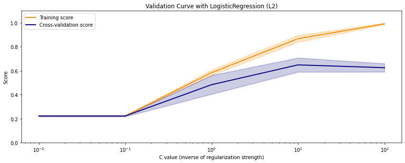{width="3.2in"
height="1.28in"}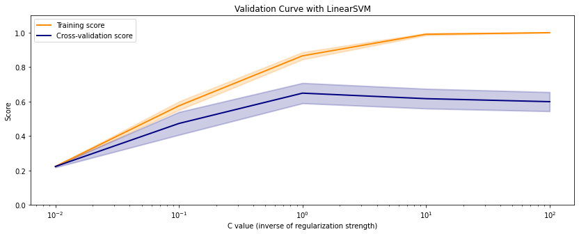{width="3.2in"
height="1.371428258967629in"}

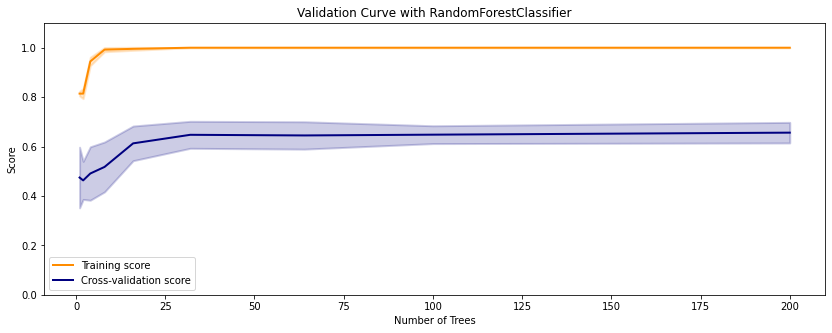{width="3.2in"
height="1.2903226159230097in"}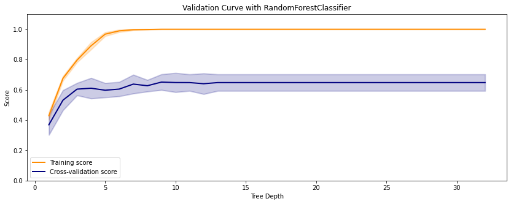{width="3.2in"
height="1.28in"}

FIGURE 3. PIT SELECTKBEST LEARNING CURVES

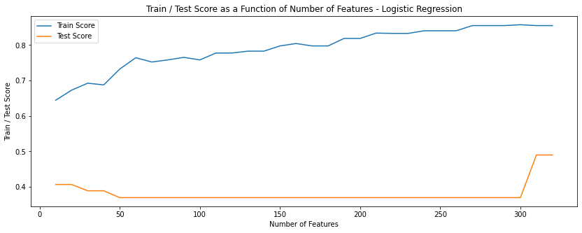{width="3.2in"
height="1.2727274715660541in"}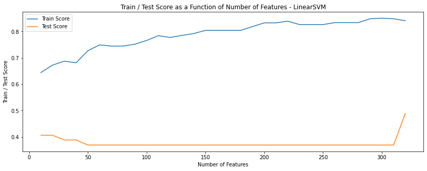{width="3.2in"
height="1.28in"}

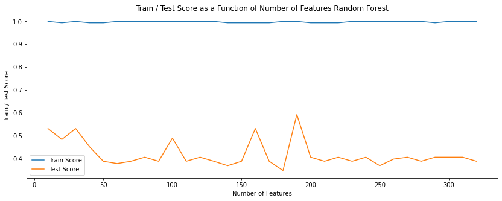{width="3.2in" height="1.28in"}

FIGURE 4. PIT PCA LEARNING CURVES

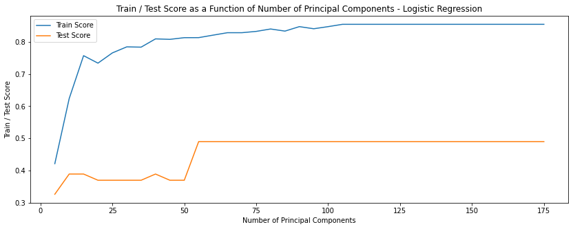{width="3.2in"
height="1.269332895888014in"}{width="3.2in"
height="1.269332895888014in"}

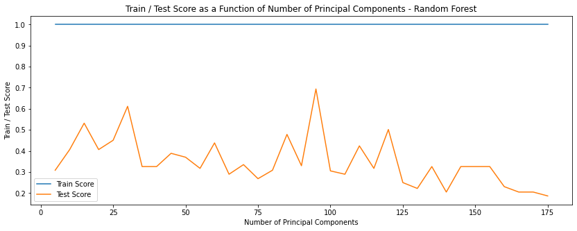{width="3.2in" height="1.28in"}

FIGURE 5. CAGR BASELINE LEARNING CURVES

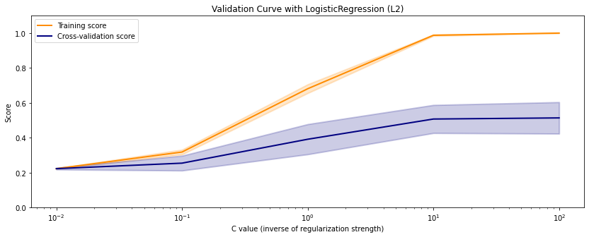{width="3.2in"
height="1.290667104111986in"}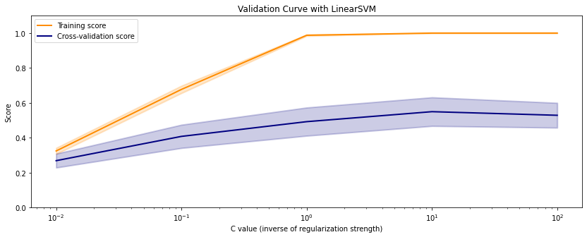{width="3.2in"
height="1.3013331146106737in"}

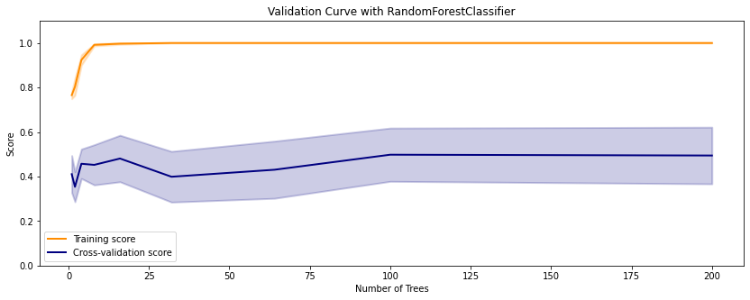{width="3.2in"
height="1.290667104111986in"}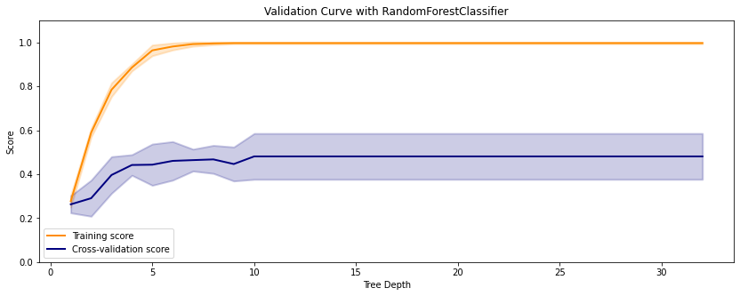{width="3.2in"
height="1.28in"}

FIGURE 6. CAGR SELECTKBEST LEARNING CURVES

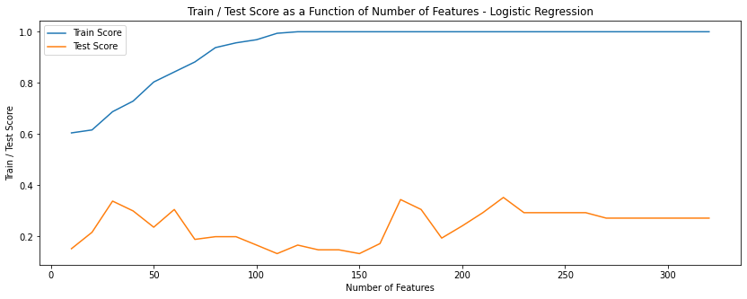{width="3.2in"
height="1.28in"}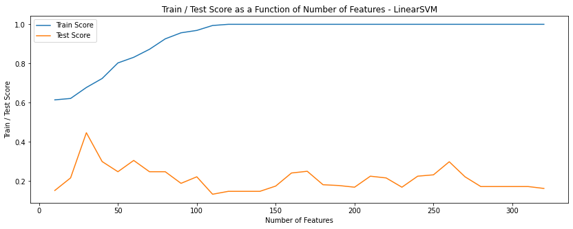{width="3.2in"
height="1.28in"}

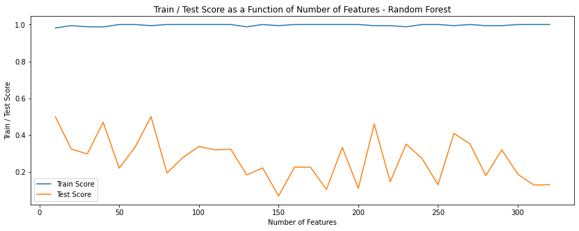{width="3.2in"
height="1.269332895888014in"}

FIGURE 7. CAGR PCA LEARNING CURVES

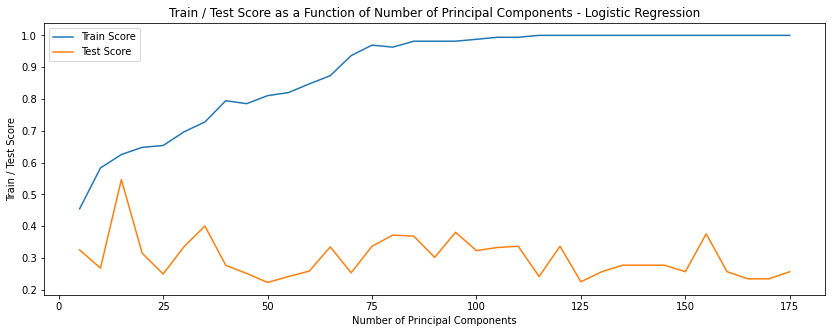{width="3.2in"
height="1.2703029308836395in"}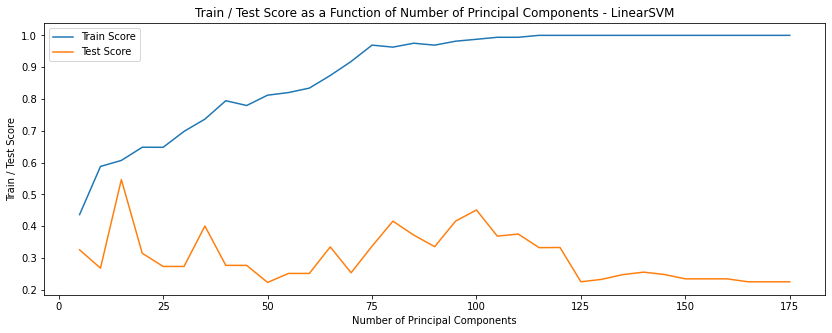{width="3.2in"
height="1.28in"}

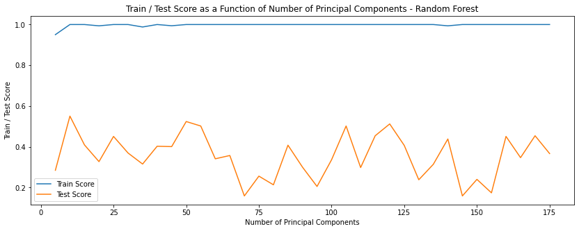{width="3.2in" height="1.28in"}

FIGURE 8. MOST COMMON PREDICTORS (+/-) FOR HIGH, MEDIUM, AND LOW GROWTH

  **HIGH GROWTH**     
  ------------------- -------------------------------------------------------------------------------------------
  Positive Feature    Percent!!UNITS IN STRUCTURE!!Total housing units!!5 to 9 units_15\'
  Negative Feature    Percent!!RACE!!One race!!Some other race_15\'
                      
  **MEDIUM GROWTH**   
  Positive Feature    Percent!!RACE!!One race!!American Indian and Alaska Native!!Chippewa tribal grouping_15\'
  Negative Feature    Percent!!UNITS IN STRUCTURE!!Total housing units!!5 to 9 units_15\'
                      
  **LOW GROWTH**      
  Positive Feature    Percent!!VALUE!!Owner-occupied units!!\$100,000 to \$149,999_15\'
  Negative Feature    Percent!!UNITS IN STRUCTURE!!Total housing units!!5 to 9 units_15\'
